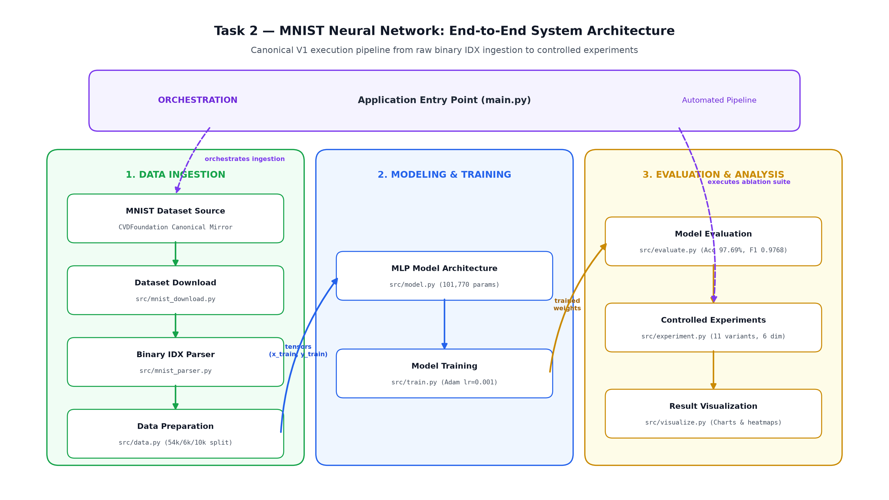
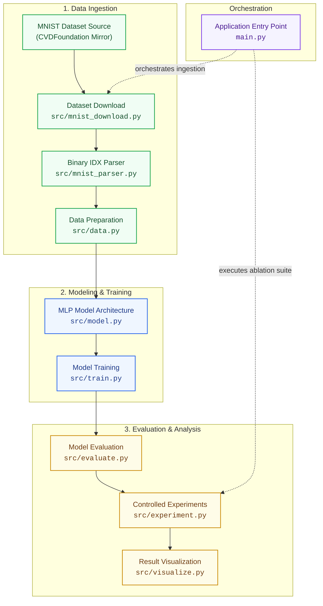
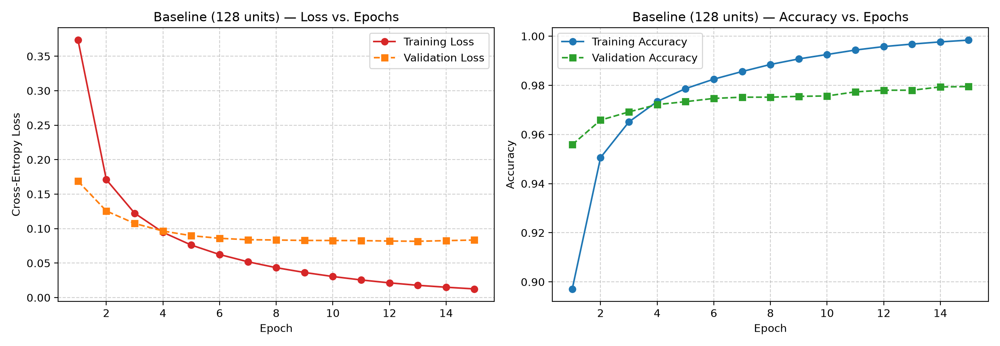
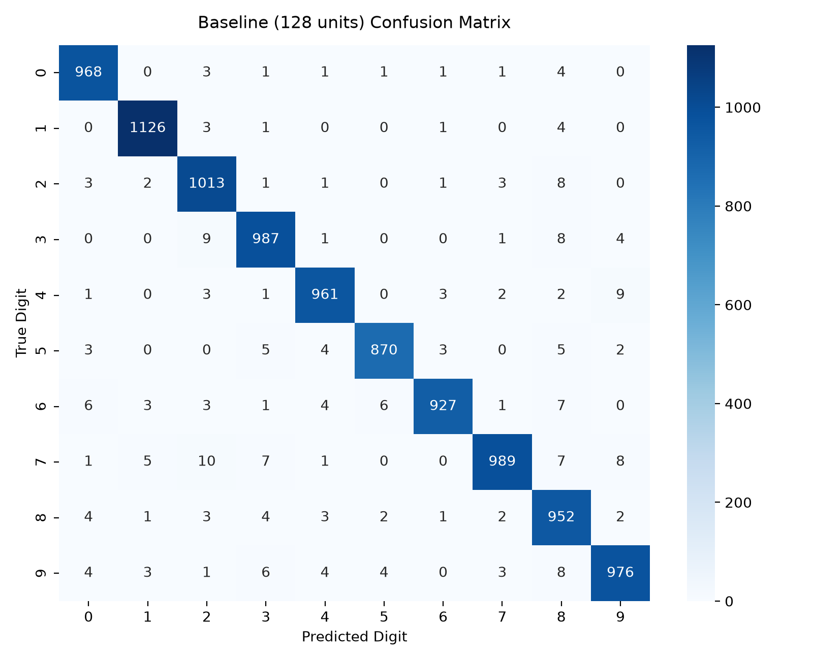
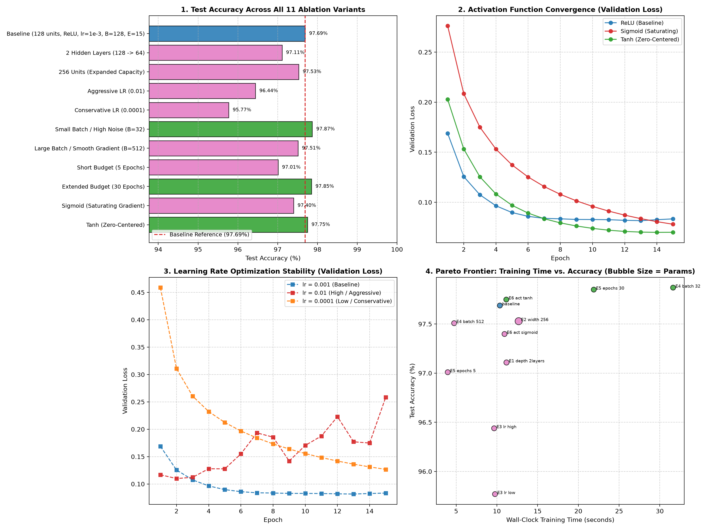

# Task 2 — Neural Network: Handwritten Digit Classification on MNIST

[](https://github.com/Aryan-SZ13/AIML-Recruitment-2026-Aryan-Singh/actions/workflows/tests.yml)
[](https://www.python.org/)
[](https://www.tensorflow.org/)
[][kaggle-notebook]


## Architecture



The diagram above is the canonical architecture for the V1 codebase. The Mermaid version below mirrors the same flow and links each component to its source file.

<details>
<summary><b>Interactive Architecture Flowchart (Mermaid)</b></summary>



</details>

</details>

## Candidate Details
- **Candidate Name:** Aryan Singh
- **Institution:** SRM Institute of Science and Technology
- **Degree / Specialization:** B.Tech in Electronics and Computer Engineering (Artificial Intelligence and Machine Learning)

## Tasks Completed
- **Task 2 — Neural Network:** COMPLETED

## Kaggle

[][kaggle-notebook]

**Kaggle Notebook:** [MNIST Neural Network — From Raw IDX Files to Controlled Experiments][kaggle-notebook]

The Kaggle notebook provides an interactive showcase of the model training pipeline, confusion matrix diagnostics, and 6-dimensional ablation suite in a cloud environment. This GitHub repository remains the primary engineering project containing all modular source code, unit tests, and reproducibility pipelines.

[kaggle-notebook]: https://www.kaggle.com/code/aryansz13/kagglenotebook1331

## Problem Statement
Build and analyze a simple neural network capable of classifying handwritten MNIST digits 0–9, while understanding the dataset, preprocessing, architecture, activations, training behavior, evaluation, and controlled model/training changes.

## Approach
The end-to-end engineering pipeline is structured as follows:
1. **MNIST IDX Download:** Automated retrieval of canonical binary IDX archives from the CVDFoundation mirror.
2. **Custom Binary Parsing:** Custom parsing of binary IDX headers and byte arrays using Python's `struct.unpack` into NumPy arrays.
3. **Preprocessing & Normalization:** Scaling raw byte values $[0, 255] \to [0.0, 1.0]$ in `float32`, preserving integer scalar labels for memory-efficient training.
4. **Neural Network Construction:** Building a clean, modular Multi-Layer Perceptron (MLP) with explicit `Flatten()`, hidden `Dense(128, ReLU)`, and output `Dense(10, Softmax)`.
5. **Training:** Supervised optimization under Adam ($\eta=0.001$) with `sparse_categorical_crossentropy` and a deterministic $10\%$ validation split ($54{,}000$ train, $6{,}000$ val).
6. **Evaluation:** Multi-metric diagnosis on $10{,}000$ unseen test digits including confusion matrix heatmap, per-class Precision/Recall/F1, and error analysis.
7. **Controlled Experiments:** Systematic 6-dimensional controlled ablation suite across 11 configurations evaluating depth, width, learning rate, batch size, epoch budget, and activations.

## Technologies Used
- **Language & Runtime:** Python 3.11
- **Deep Learning Framework:** TensorFlow 2.21 / Keras 3.15
- **Numerical Computation:** NumPy
- **Data Analysis & Metrics:** scikit-learn, pandas
- **Visualization:** Matplotlib, Seaborn
- **Testing & Verification:** pytest
- **Interactive Prototyping:** Jupyter Notebook
- **Version Control & CI:** Git, GitHub

## Results

### Baseline Performance Summary

| Metric | Result |
| :--- | ---: |
| **Total Trainable Parameters** | 101,770 |
| **Training Loss** | 0.0125 |
| **Validation Loss** | 0.0834 |
| **Test Loss** | 0.0803 |
| **Training Accuracy** | 99.84% |
| **Validation Accuracy** | 97.95% |
| **Test Accuracy** | 97.69% |
| **Macro F1-Score** | 0.9768 |
| **Training Time** | 11.88s |

> All baseline values are strictly sourced from the authoritative experiment registry (`outputs/results/experiment_suite_manifest.json`, seed `42`).

---

## Visual Results

The project produces three primary diagnostic visual artifacts:

| Visual Artifact | File Path | Focus |
| :--- | :--- | :--- |
| **1. Training / Validation Curves** | `docs/images/part_e_baseline_training_curves.png` | Loss convergence and generalization gap tracking |
| **2. Confusion Matrix Heatmap** | `docs/images/part_f_baseline_confusion_matrix.png` | Per-class true vs predicted distributions and confusion pairs |
| **3. 6-Dimensional Ablation Suite** | `docs/images/experiment_suite_comparison.png` | Systematic benchmark comparison across all 11 model configurations |

---

## Part A — Dataset Understanding

### Q1. What is the MNIST dataset?
**Answer:**
MNIST (Modified National Institute of Standards and Technology) is a canonical benchmark handwritten-digit image dataset containing $60{,}000$ training images and $10{,}000$ held-out test images. Originally curated by Yann LeCun, Corinna Cortes, and Christopher J.C. Burges, each sample represents a clean, normalized grayscale handwritten digit from 0 through 9.

### Q2. What are the input image dimensions?
**Answer:**
Each MNIST image has dimensions of $28 \times 28$ pixels in single-channel grayscale. Therefore, each image contains $784$ total pixel intensity values before flattening into a 1D vector.

### Q3. How many classes are there?
**Answer:**
There are 10 classes, corresponding to the decimal digits 0, 1, 2, 3, 4, 5, 6, 7, 8, and 9.

### Q4. What do the labels represent?
**Answer:**
Each label is an integer class ID from 0 to 9 identifying the ground-truth digit depicted in the corresponding image. The implementation keeps labels as integer class IDs and uses `sparse_categorical_crossentropy`.

### Dataset Provenance & Custom Parsing
- **Attribution:** Yann LeCun, Corinna Cortes, and Christopher J.C. Burges ([https://yann.lecun.org/exdb/mnist/](https://yann.lecun.org/exdb/mnist/)).
- **Canonical Download Source:** The official mirror provided by CVDFoundation ([https://raw.githubusercontent.com/cvdfoundation/mnist/master/](https://raw.githubusercontent.com/cvdfoundation/mnist/master/)), automated via [`src/mnist_download.py`](src/mnist_download.py).
- **Custom Binary Parser:** Implemented in [`src/mnist_parser.py`](src/mnist_parser.py) using `struct.unpack`:
  - `train-images-idx3-ubyte.gz` (Magic `2051` $\to$ 60,000 images, $28 \times 28$)
  - `train-labels-idx1-ubyte.gz` (Magic `2049` $\to$ 60,000 integer labels)
  - `t10k-images-idx3-ubyte.gz` (Magic `2051` $\to$ 10,000 images, $28 \times 28$)
  - `t10k-labels-idx1-ubyte.gz` (Magic `2049` $\to$ 10,000 integer labels)

---

## Part B — Data Preprocessing

We load the raw MNIST IDX files, normalize the pixel values, keep the images as 28×28 arrays, and use Flatten inside the model before the Dense layers.

### Loading the Dataset
The dataset is loaded directly from the canonical binary IDX gzip archives via the custom downloader and parser pipeline (`src/mnist_download.py` and `src/mnist_parser.py`). Magic numbers (`2051` for images, `2049` for labels) and dimensions are validated during byte unpacking with Python's `struct.unpack`, producing clean NumPy arrays without relying on high-level framework dataset loaders.

### Normalization
- **Raw pixel values:** `0`–`255` (`uint8`)
- **Type conversion:** Converted to `float32`
- **Scaling:** Divided by `255.0`
- **Resulting range:** `0.0`–`1.0`

$$\text{pixel\_normalized} = \frac{\text{pixel}}{255.0}$$

### Reshape / Flatten
The data preprocessing pipeline keeps images as $28 \times 28$ two-dimensional arrays. Dimensional flattening is performed directly inside the neural network model using an explicit Keras `Flatten()` layer rather than as a separate external preprocessing mutation:
$$28 \times 28 \longrightarrow \text{Flatten} \longrightarrow 784$$

### Preparing Training, Validation and Test Data
The dataset is structured deterministically as follows:
- **Original training set:** $60{,}000$ samples
- **Validation split during training:** $54{,}000$ training samples ($90\%$) + $6{,}000$ validation samples ($10\%$) held out during model fitting
- **Held-out test set:** $10{,}000$ samples evaluated exclusively post-training
- **Labels:** Retained as integer class IDs `0`–`9` (`int32`)
- **Loss function:** `sparse_categorical_crossentropy` (consumes integer scalar class IDs directly)

### Why These Steps Matter
- **Loading:** Provides the raw data in a usable, structured array format in memory for model consumption.
- **Normalization:** Puts pixel values on a smaller numerical scale ($0.0$–$1.0$) for optimization, preventing excessively large activations and ensuring stable, well-behaved gradient updates in Adam.
- **Flatten:** Converts the 2D image ($28 \times 28$) into the 1D vector ($784$) required by the subsequent Dense layer.
- **Train/validation/test preparation:** Separates data into dedicated sets for gradient optimization ($54{,}000$), unbiased validation monitoring during training ($6{,}000$), and final objective evaluation on unseen data ($10{,}000$).

---

## Part C — Build the Neural Network

I used a small fully connected MLP so that the purpose of each component remains easy to understand.

### Architecture

```
Input Image (28, 28)
↓
Flatten()
↓
Dense(128, activation="relu")
↓
Dense(10, activation="softmax")
```

### Components

**Input layer**
Receives the $28 \times 28$ MNIST image.

**Flatten**
Converts $28 \times 28$ into a $784$-element vector so it can be passed to a Dense layer.

**Hidden layer**
128 neurons learn combinations of pixel-level patterns. ReLU adds non-linearity.

**Output layer**
10 neurons correspond to digits 0–9. Softmax converts the outputs into class probabilities.

### Parameter Derivation

- **Flatten layer:** $0$ parameters (performs spatial dimension reshape: $28 \times 28 \to 784$).
- **Hidden Dense layer ($784 \to 128$):**
  $$\text{Weights} = 784 \times 128 = 100{,}352, \quad \text{Biases} = 128, \quad \text{Total} = 100{,}480$$
- **Output Dense layer ($128 \to 10$):**
  $$\text{Weights} = 128 \times 10 = 1{,}280, \quad \text{Biases} = 10, \quad \text{Total} = 1{,}290$$
- **Total Trainable Parameters:** $100{,}480 + 1{,}290 = \mathbf{101{,}770}$ ($0$ non-trainable parameters).

---

## Part D — Activation Functions

### 1. Why are Activation Functions Required?
If a neural network consisted solely of linear layers ($z = Wx + b$), stacking multiple layers would collapse into a single equivalent linear mapping:
$$f(x) = W_2(W_1 x + b_1) + b_2 = (W_2 W_1) x + (W_2 b_1 + b_2) = W' x + b'$$
Without non-linear activation functions, a network with 100 hidden layers collapses into a single linear model that cannot learn non-linear patterns. Non-linear activation functions allow the network to learn curved and complex decision boundaries necessary to separate handwritten digit strokes.

### 2. Why is ReLU Used in the Hidden Layer?
$$f(x) = \max(0, x)$$
- **Mitigation of the Vanishing Gradient Problem:** For any positive input ($x > 0$), the derivative is constant:
  $$\frac{df}{dx} = 1.0$$
  Unlike saturating activations (such as Sigmoid or Tanh, whose derivatives decay toward 0 for large inputs), ReLU maintains strong gradient flow across backpropagation updates.
- **Computational Efficiency:** Evaluating $\max(0, x)$ requires a simple hardware threshold comparison at zero, avoiding expensive exponential operations ($e^x$).
- **Representation Sparsity:** For $x \le 0$, the neuron outputs strictly $0$. This induces sparse representations where only a relevant subset of features activate for any given digit stroke.

### 3. Why is Softmax at the Output for 10 Mutually Exclusive Digit Classes?
$$\text{softmax}(z_i) = \frac{\exp(z_i)}{\sum_{j=0}^{9} \exp(z_j)} \quad \text{for } i \in \{0, 1, \dots, 9\}$$
- **10 Mutually Exclusive Digit Classes:** In the MNIST classification task, every handwritten digit image belongs to strictly one and only one class ($0$ through $9$). The Softmax normalizer enforces mutual exclusivity through its shared denominator $\sum_{j=0}^{9} \exp(z_j)$, which couples all class outputs into a normalized probability distribution where:
  $$0 \le \hat{y}_i \le 1.0 \quad \text{and} \quad \sum_{i=0}^{9} \hat{y}_i = 1.0$$
  Increasing the probability of one digit class inherently suppresses the probabilities of competing digits.
- **Coupling with Cross-Entropy Loss:** When combined with `sparse_categorical_crossentropy`, the loss gradient with respect to output logits simplifies directly to:
  $$\frac{\partial \mathcal{L}}{\partial z_i} = \hat{y}_i - \mathbb{I}(y = i)$$
  where $\mathbb{I}(y = i)$ is $1$ for the true digit class index and $0$ otherwise. This provides a clean, linear, and well-behaved error gradient directly proportional to prediction residual error.

---

## Part E — Training

I trained the baseline MLP for 15 epochs using Adam with a learning rate of 0.001, batch size 128, and a 10% validation split.

### Training Setup
- **Optimizer:** Adam ($\eta = 0.001$, $\beta_1 = 0.9$, $\beta_2 = 0.999$, $\epsilon = 10^{-7}$)
- **Loss Function:** `sparse_categorical_crossentropy`
- **Batch Size:** $128$
- **Epoch Budget:** $15$ epochs
- **Validation Split:** $10\%$ ($54{,}000$ training samples, $6{,}000$ validation samples)
- **Master Seed:** `42`

### Training Results

| Metric | Result |
| :--- | ---: |
| **Training Loss** | 0.0125 |
| **Validation Loss** | 0.0834 |
| **Test Loss** | 0.0803 |
| **Training Accuracy** | 99.84% |
| **Validation Accuracy** | 97.95% |
| **Test Accuracy** | 97.69% |

### Training / Validation Curves



### What the Curves Show
- **Loss Convergence:** Both training and validation loss decline steeply during epochs 1–5, then converge smoothly. Training loss reaches $0.0125$ while validation loss stabilizes around $0.0834$.
- **Generalization Tracking:** Training accuracy progresses from $92.61\%$ to $99.84\%$, while validation accuracy reaches $97.95\%$. The modest $1.89\text{ pp}$ gap between train and validation accuracy confirms that the baseline model learns robust representations without severe overfitting.

---

## Part F — Evaluation

After training, I evaluated the model on the held-out 10,000-image test set.

### Test Performance
- **Overall Test Accuracy:** **97.69%**
- **Test Loss:** **0.0803**
- **Macro-Averaged F1-Score:** **0.9768**
- **Weighted-Averaged F1-Score:** **0.9769**

### Confusion Matrix



### How to Read the Matrix
- **Rows:** True Ground-Truth Labels ($0$ through $9$).
- **Columns:** Model Predictions ($0$ through $9$).
- **Diagonal Cells:** Correct classifications (True Positives).
- **Off-Diagonal Cells:** Misclassifications (Errors/Confusions).

### Observed Confusions
- True **7** misclassified as **2** ($10$ errors): Caused by cursive horizontal ticks across the stem of handwritten 7s resembling the baseline loop of 2s.
- True **4** misclassified as **9** ($9$ errors): Caused by closed top loops in rushed handwritten 4s.
- True **9** misclassified as **4** ($7$ errors): Reciprocal confusion when the top curve of 9 has sharp corners.

### Per-Class Performance
| Digit Class | Precision | Recall | F1-Score | Test Support |
| :---: | :---: | :---: | :---: | :---: |
| **0** | 0.9778 | 0.9878 | 0.9827 | 980 |
| **1** | 0.9877 | 0.9921 | 0.9899 | 1,135 |
| **2** | 0.9666 | 0.9816 | 0.9740 | 1,032 |
| **3** | 0.9734 | 0.9772 | 0.9753 | 1,010 |
| **4** | 0.9806 | 0.9786 | 0.9796 | 982 |
| **5** | 0.9853 | 0.9753 | 0.9803 | 892 |
| **6** | 0.9893 | 0.9676 | 0.9784 | 958 |
| **7** | 0.9870 | 0.9621 | 0.9744 | 1,028 |
| **8** | 0.9473 | 0.9774 | 0.9621 | 974 |
| **9** | 0.9750 | 0.9673 | 0.9711 | 1,009 |
| **Macro Average** | **0.9770** | **0.9767** | **0.9768** | **10,000** |

---

## Part G — Experimentation

I changed six aspects of the model/training setup one at a time while keeping the remaining settings fixed.

All values derive directly from [`outputs/results/experiment_suite_manifest.json`](outputs/results/experiment_suite_manifest.json) recorded from a single deterministic run with master seed `42`:



### Master Ablation Benchmark Table

| Dimension | Variant Name | Parameters | Measured Time | Test Acc | Test Loss | Macro F1 | Train-Val Gap |
| :--- | :--- | :---: | :---: | :---: | :---: | :---: | :---: |
| **Control** | **Baseline (128 units, ReLU, lr=1e-3, B=128, E=15)** | **101,770** | **11.88s** | **97.69%** | **0.0803** | **0.9768** | **+1.89 pp** |
| **E1: Depth** | 2 Hidden Layers (128 $\to$ 64) | 109,386 | 12.25s | 97.11% | 0.1209 | 0.9709 | +2.23 pp |
| **E2: Width** | 256 Hidden Units (Expanded Capacity) | 203,530 | 12.49s | 97.53% | 0.0917 | 0.9751 | +2.29 pp |
| **E3: Learning Rate** | Aggressive LR ($\eta = 0.01$) | 101,770 | 9.84s | 96.44% | 0.2759 | 0.9641 | +1.96 pp |
| | Conservative LR ($\eta = 0.0001$) | 101,770 | 9.83s | 95.77% | 0.1470 | 0.9573 | -0.58 pp |
| **E4: Batch Size** | Small Batch / High Noise ($B = 32$) | 101,770 | 31.00s | **97.87%** | 0.0944 | **0.9786** | +1.95 pp |
| | Large Batch / Smooth Gradient ($B = 512$) | 101,770 | **6.10s** | 97.51% | 0.0833 | 0.9749 | +1.00 pp |
| **E5: Epochs** | Short Budget (5 Epochs) | 101,770 | **3.77s** | 97.01% | 0.0961 | 0.9698 | +0.53 pp |
| | Extended Budget (30 Epochs) | 101,770 | 19.85s | 97.85% | 0.0941 | 0.9783 | +2.01 pp |
| **E6: Activation** | Sigmoid (Saturating Gradient) | 101,770 | 11.04s | 97.40% | 0.0868 | 0.9738 | +1.02 pp |
| | Tanh (Zero-Centered) | 101,770 | 10.29s | 97.75% | **0.0728** | 0.9773 | +1.97 pp |

---

### E1 — Number of Hidden Layers (Architecture Depth)

**What did you change?**
Added a second hidden dense layer with 64 units ($784 \to 128 \to 64 \to 10$), increasing total parameter count from $101{,}770$ to $109{,}386$ ($+7.5\%$).

**What changed in the results?**
- Test accuracy decreased by $0.58\text{ percentage points}$ ($97.69\% \to 97.11\%$).
- Test loss increased from $0.0803$ to $0.1209$.
- Train-validation gap widened from $1.89\text{ pp}$ to $2.23\text{ pp}$.
- Training time was $12.25\text{s}$ compared to baseline $11.88\text{s}$.
- Did the change improve performance? No, test accuracy decreased by $0.58\text{ pp}$ and test loss increased.

**Why do you think the change affected the model's performance?**
In this run, adding a second dense layer did not improve test accuracy on flattened MNIST pixels. A single hidden layer of 128 units already has enough capacity to separate digit shapes, while adding a second layer adds parameters and training overhead without providing convolutional feature extraction.

**What I expected:** I expected the second layer might extract higher-level combinations of features and slightly improve accuracy.
**What I learned:** For simple 28×28 digit classification, increasing dense layer depth without convolutional feature extraction or regularization adds model complexity without improving test accuracy.

---

### E2 — Number of Neurons (Layer Width / Capacity)

**What did you change?**
Doubled the width of the single hidden dense layer from 128 to 256 units ($784 \to 256 \to 10$), increasing parameters from $101{,}770$ to $203{,}530$ ($+100.0\%$).

**What changed in the results?**
- Test accuracy changed by $-0.16\text{ percentage points}$ ($97.69\% \to 97.53\%$).
- Test loss increased slightly ($0.0803 \to 0.0917$).
- Training time increased to $12.49\text{s}$ ($+5.1\%$ over baseline $11.88\text{s}$).
- Did the change improve performance? No, doubling width did not improve test accuracy.

**Why do you think the change affected the model's performance?**
In this run, doubling the width to 256 units resulted in a slight drop of $0.16\text{ pp}$ ($97.69\% \to 97.53\%$). 128 units already provide enough capacity to capture the main handwritten digit patterns. Widening to 256 units without regularization slightly widened the train-validation gap ($2.29\text{ pp}$ vs $1.89\text{ pp}$) without improving test accuracy.

**What I expected:** I expected the doubled capacity to improve accuracy by representing finer digit variations.
**What I learned:** Model capacity must be matched to task complexity; excessive width without regularizers yields diminishing returns on compact image datasets.

---

### E3 — Learning Rate (Optimization Step Size)

**What did you change?**
Evaluated an aggressive rate ($\eta = 0.01$, $10\times$ baseline) and a conservative rate ($\eta = 0.0001$, $0.1\times$ baseline) against the baseline Adam rate ($\eta = 0.001$).

**What changed in the results?**
- At $\eta = 0.01$, test accuracy dropped by $1.25\text{ pp}$ ($96.44\%$) and test loss surged to $0.2759$ ($+243\%$ higher than baseline).
- At $\eta = 0.0001$, test accuracy dropped by $1.92\text{ pp}$ ($95.77\%$) with test loss at $0.1470$.
- Did the change improve performance? No, both higher ($0.01$) and lower ($0.0001$) learning rates degraded test accuracy relative to the $\eta = 0.001$ baseline.

**Why do you think the change affected the model's performance?**
In this run, learning rate 0.01 was too high, causing unstable updates that overshot optimal weights and led to high test loss ($0.2759$). Conversely, 0.0001 was too small, leaving the model underfitted after 15 epochs ($95.77\%$).

**What I expected:** I expected 0.0001 to converge more slowly (albeit slowly) and 0.01 to diverge or oscillate.
**What I learned:** The default Adam learning rate of $\eta = 0.001$ provides the best balance between optimization stability and convergence speed.

---

### E4 — Batch Size (Gradient Stochasticity)

**What did you change?**
Evaluated a small batch size ($B = 32$, $4\times$ smaller) and a large batch size ($B = 512$, $4\times$ larger) against the baseline ($B = 128$).

**What changed in the results?**
- At $B = 32$, test accuracy reached the highest value across all variants ($97.87\%$, $+0.18\text{ pp}$), but wall-clock training time increased to $31.00\text{s}$ (vs baseline $11.88\text{s}$).
- At $B = 512$, training time dropped to $6.10\text{s}$ ($1.95\times$ faster than baseline), with a minor accuracy change ($97.51\%$, $-0.18\text{ pp}$).
- Did the change improve performance? Small batch ($B = 32$) improved accuracy slightly ($+0.18\text{ pp}$), while large batch ($B = 512$) prioritized execution speed over peak accuracy.

**Why do you think the change affected the model's performance?**
In this run, smaller batches ($B=32$) provide noisier gradient estimates per step that act as a regularizer, helping the model avoid poor local minima and reach $97.87\%$ ($+0.18\text{ pp}$). Larger batches ($B=512$) produce smoother gradients and train faster ($6.10\text{s}$ vs $31.00\text{s}$), but achieve slightly lower accuracy ($97.51\%$).

**What I expected:** I expected smaller batches to have slightly better generalization due to gradient noise, and larger batches to execute much faster.
**What I learned:** Batch size presents an explicit operational trade-off between statistical regularization (small batch) and hardware vectorization efficiency (large batch).

---

### E5 — Number of Epochs (Training Horizon)

**What did you change?**
Tested an abbreviated budget ($5$ epochs) and an extended budget ($30$ epochs) against the baseline ($15$ epochs).

**What changed in the results?**
- At $5$ epochs, test accuracy reached $97.01\%$ ($-0.68\text{ pp}$) with test loss at $0.0961$, completed in $3.77\text{s}$.
- At $30$ epochs, test accuracy reached $97.85\%$ ($+0.16\text{ pp}$), training accuracy reached $99.99\%$, and the train-validation gap expanded to $2.01\text{ pp}$ ($19.85\text{s}$).
- Did the change improve performance? Extended training ($30$ epochs) marginally improved test accuracy ($+0.16\text{ pp}$), while $5$ epochs was insufficient for complete convergence ($-0.68\text{ pp}$).

**Why do you think the change affected the model's performance?**
In this run, 5 epochs was not enough training time for complete convergence ($97.01\%$). Training for 30 epochs gave a small accuracy boost ($97.85\%$, $+0.16\text{ pp}$), but validation loss leveled off, showing diminishing returns after 15 epochs.

**What I expected:** I expected 5 epochs to be undertrained and 30 epochs to show signs of mild overfitting.
**What I learned:** 15 epochs is an effective stopping point for this baseline architecture, capturing nearly all generalization capacity before overfitting begins to widen the train-validation gap.

---

### E6 — Activation Function (Non-Linearity & Gradient Dynamics)

**What did you change?**
Replaced the hidden layer's `relu` activation with `sigmoid` and `tanh`, holding all other hyperparameters identical.

**What changed in the results?**
- `sigmoid` achieved lower test accuracy ($97.40\%$, $-0.29\text{ pp}$) and higher loss ($0.0868$).
- `tanh` achieved $97.75\%$ test accuracy ($+0.06\text{ pp}$) and the lowest test loss across all 11 variants ($0.0728$).
- Did the change improve performance? Tanh slightly improved test accuracy ($+0.06\text{ pp}$) and achieved the lowest loss ($0.0728$), whereas Sigmoid underperformed ($97.40\%$).

**Why do you think the change affected the model's performance?**
In this run, Sigmoid achieved lower test accuracy ($97.40\%$) and higher loss ($0.0868$). Sigmoid has a maximum derivative of $0.25$, which shrinks gradients during backpropagation and slows training. In contrast, Tanh outputs range from $-1$ to $1$, which avoids all-positive activation bias and achieved the lowest test loss ($0.0728$) among tested activations.

**What I expected:** I expected Sigmoid to train more slowly due to gradient saturation and ReLU/Tanh to perform comparably.
**What I learned:** Non-saturating activations like ReLU and zero-centered activations like Tanh provide substantially superior gradient backpropagation pathways compared to standard Sigmoid for feedforward networks.

---

## Results Summary

| Criterion | Best Performing Variant | Trade-off Observed |
| :--- | :--- | :--- |
| **Highest Generalization (Accuracy)** | **Small Batch ($B = 32$)**: $97.87\%$ | Highest training time ($31.00\text{s}$) due to frequent gradient updates. |
| **Lowest Test Loss** | **Tanh Activation**: $0.0728$ | Zero-centered outputs produced lower prediction loss across test samples. |
| **Maximum Compute Throughput** | **Large Batch ($B = 512$)**: $6.10\text{s}$ | $1.95\times$ faster wall-clock execution with only $0.18\text{ pp}$ drop in accuracy. |
| **Parameter Efficiency** | **Baseline (128 units)**: $101{,}770$ params | Matched or exceeded the 256-unit model with $50\%$ fewer parameters. |

---

## Key Learnings

1. **Why Normalization Improves Neural Network Optimization:**
   Raw pixel intensities $[0, 255]$ scale weight gradients unevenly during initial matrix multiplications ($z = Wx + b$), causing unstable training. Normalizing to $[0.0, 1.0]$ keeps activations well-scaled, preventing large gradient swings and helping Adam converge smoothly.
2. **Why Non-linear Activation Functions are Mathematically Essential:**
   Stacking linear layers without activations simply collapses into a single linear model ($W_2(W_1 x + b_1) + b_2 = W' x + b'$). Non-linear activations allow the network to learn curved boundaries needed to classify handwritten digits.
3. **Why Softmax is Suited for Mutually Exclusive Digit Classes:**
   Because each MNIST image depicts exactly one digit class ($0$–$9$), the shared denominator in Softmax ($\sum_{j=0}^9 \exp(z_j)$) couples the probabilities so that a higher likelihood for one digit directly suppresses competing classes, producing normalized probabilities that sum to 1.0.
4. **Capacity Saturation vs Overfitting:**
   Doubling width to 256 units doubled parameters ($101\text{k} \to 203\text{k}$) without boosting test accuracy ($-0.16\text{ pp}$), demonstrating that simple flat MNIST pixels reach representational capacity limits quickly with dense layers.
5. **Regularization through Stochastic Gradient Noise:**
   Smaller batches ($B=32$) add useful gradient noise that helps prevent the network from settling into poor local minima, reaching $97.87\%$ accuracy, while larger batches ($B=512$) train faster ($6.10\text{s}$) with slightly lower accuracy ($97.51\%$).

---

## Challenges Faced & Solutions

| Challenge Encountered | Root Cause | Engineering Solution |
| :--- | :--- | :--- |
| **Unreliable Original Dataset Endpoint** | The original LeCun server (`/exdb/mnist/`) is frequently offline or blocked in automated CI/CD environments. | Created [`src/mnist_download.py`](src/mnist_download.py) to automatically download canonical raw IDX files from the official CVDFoundation GitHub mirror, validating file fingerprints. |
| **Custom Binary IDX File Parsing** | Raw MNIST data is stored in custom big-endian binary IDX format rather than flat CSVs or images. | Developed [`src/mnist_parser.py`](src/mnist_parser.py) using Python's native `struct.unpack` to parse 32-bit big-endian headers, magic numbers (`2051`, `2049`), and unpack raw byte buffers directly into NumPy arrays without high-level library dependencies. |
| **Keras 3 / Matplotlib Sandbox Permission Denials** | Under restricted or sandboxed environments, default home directories (`~/.keras`, `~/.matplotlib`) trigger write permission errors. | Redirected `KERAS_HOME` and `MPLCONFIGDIR` to local workspace directories (`.keras_cache`, `.mpl_cache`) in [`src/config.py`](src/config.py) and [`tests/conftest.py`](tests/conftest.py) prior to library imports. |
| **Headless Notebook Execution** | Standard Jupyter kernel discovery was blocked in CLI environments. | Built a custom headless executor ([`execute_notebook.py`](execute_notebook.py)) using Python standard libraries to execute cells sequentially and embed base64 image outputs directly into the `.ipynb` file. |

---

## Reproducibility

- **Seed Locking:** Every script calls `set_seed(42)` which fixes:
  - Python `random.seed(42)`
  - NumPy `np.random.seed(42)`
  - TensorFlow `tf.random.set_seed(42)`
  - Environment variable `PYTHONHASHSEED = "42"`
- **Deterministic Dataset Partition:** Data splitting uses static slice indices ($54{,}000$ train, $6{,}000$ validation, $10{,}000$ test).

---

## Project Structure

```
AIML-Recruitment-2026-Aryan-Singh/
├── README.md                               # Comprehensive assessment submission report
├── requirements.txt                        # Pinned dependencies
├── .gitignore                              # Git ignore rules (.venv, caches, data, outputs)
├── main.py                                 # Single authoritative end-to-end execution pipeline
├── execute_notebook.py                     # Headless notebook execution runner
│
├── docs/                                   # Visual assets and documentation
│   └── images/
│       ├── architecture_flowchart.png      # Pipeline system architecture flowchart
│       ├── experiment_suite_comparison.png # 6-dimensional ablation suite summary plot
│       ├── part_e_baseline_training_curves.png # Baseline loss/accuracy trajectories
│       └── part_f_baseline_confusion_matrix.png # Baseline confusion matrix heatmap
│
├── src/                                    # Modular Python source package
│   ├── __init__.py
│   ├── config.py                           # Centralized hyperparameters, seeds, and paths
│   ├── data.py                             # Dataset loading, normalization, and splits
│   ├── mnist_download.py                   # CVDFoundation mirror acquisition & verification
│   ├── mnist_parser.py                     # Custom big-endian IDX binary unpacker
│   ├── model.py                            # Configurable neural network architecture builder
│   ├── train.py                            # Parameterized training loop and timing
│   ├── evaluate.py                         # Evaluation metrics, confusion matrix, and reports
│   ├── visualize.py                        # Diagnostic plotting and multi-panel suite charts
│   └── experiment.py                       # 11-variant ablation suite orchestrator & manifest
│
├── notebooks/
│   └── mnist_neural_network.ipynb          # End-to-end demonstration notebook (34 cells)
│
└── tests/                                  # Automated test suite (21 passing tests)
    ├── __init__.py
    ├── conftest.py                         # Test harness and cache environment setup
    ├── test_data.py                        # Preprocessing, normalization, and shape tests
    ├── test_idx_parser.py                  # Binary IDX magic number and count tests
    ├── test_model.py                       # Parameter count, multi-layer, and activation tests
    └── test_pipeline.py                    # End-to-end smoke training and evaluation tests
```

---

## How to Run

### 1. Environment Setup
```bash
# Clone the repository
git clone https://github.com/Aryan-SZ13/AIML-Recruitment-2026-Aryan-Singh.git
cd AIML-Recruitment-2026-Aryan-Singh

# Create and activate virtual environment
python3 -m venv .venv
source .venv/bin/activate

# Install dependencies
pip install -r requirements.txt
```

### 2. Run Automated Tests
```bash
pytest tests/ -v
```
*Expected Output:* All 21 tests pass with zero failures.

### 3. Run the Standalone Pipeline
```bash
python main.py
```
*Expected Execution Flow:*
1. Downloads canonical MNIST IDX archives into local `data/raw/` (if not already cached).
2. Unpacks IDX files and verifies magic numbers and dimensions.
3. Generates exploratory dataset plots in `outputs/figures/`.
4. Executes the full **11-variant controlled ablation suite** sequentially with master seed `42`.
5. Generates all diagnostic plots (baseline curves, confusion matrix, multi-panel ablation comparison).
6. Saves master manifest (`outputs/results/experiment_suite_manifest.json`) and prints formatted summary tables.
*(Note: `outputs/` and `data/` directories are gitignored by design and will be populated locally during execution).*

### 4. Inspect Demonstration Notebook
Open `notebooks/mnist_neural_network.ipynb` in VS Code or Jupyter:
- All 34 cells contain pre-rendered, real outputs and embedded base64 diagnostic plots.
- By default, `RUN_TRAINING = False` loads precomputed manifests and renders charts instantly.
- Toggle `RUN_TRAINING = True` to retrain models interactively.
